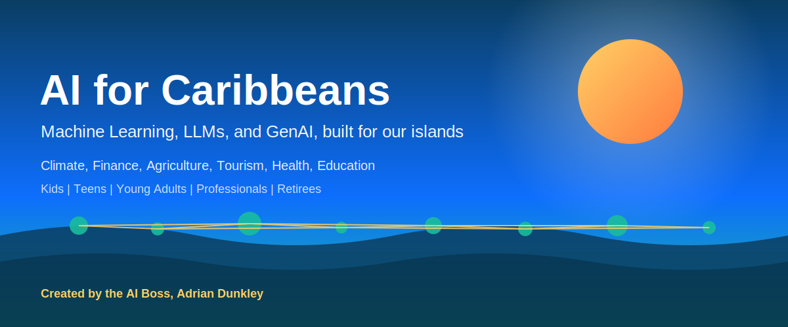

<p align="center">
  
</p>

# AI for Caribbeans

A practical learning repository that teaches Artificial Intelligence, Machine Learning, Large Language Models, and Generative AI through Caribbean examples. Every dataset, story, prompt, and project is rooted in our region. The goal is simple: give every Caribbean person, from a kid in Kingston to a retiree in Grenada, the tools to use AI for real life and real work.

**Created by the AI Boss, Adrian Dunkley.**

## Why this exists

Most AI courses teach with examples from places that look nothing like home. Iris flowers, Boston housing, Titanic passengers. They work, but they do not speak to us. This repo flips that. We learn ML on hurricane data, predict yam yields, classify reggae versus soca, analyse remittance flows, and use LLMs that understand "wah gwaan" and "ah lyme".

## Who this is for

| Audience | What you get |
|----------|--------------|
| [Kids (ages 7-12)](audiences/kids/README.md) | Story based lessons, simple games, no code first then beginner Python |
| [Teens (ages 13-18)](audiences/teens/README.md) | Build your first model, chatbots in patois, school project ideas |
| [Young Adults (ages 19-30)](audiences/young-adults/README.md) | Career paths, portfolio projects, freelance AI work, side hustles |
| [Working Professionals](audiences/working-professionals/README.md) | Apply AI in your job: banking, tourism, public sector, agriculture |
| [Retirees](audiences/retirees/README.md) | Use AI safely, write letters, manage health, avoid scams, stay sharp |

## Courses

Six full courses, each with notebooks, scripts, datasets, and Caribbean case studies.

1. [Foundations of AI](courses/01-foundations/README.md). What AI is, what it is not, how it works under the hood.
2. [Supervised Machine Learning](courses/02-supervised-ml/README.md). Predict rainfall in Saint Lucia, classify mangoes, forecast tourist arrivals.
3. [Unsupervised Machine Learning](courses/03-unsupervised-ml/README.md). Cluster Caribbean dialects, segment customers at a Bridgetown supermarket.
4. [Deep Learning](courses/04-deep-learning/README.md). Image models for coral reef health, audio models for bird calls.
5. [Large Language Models](courses/05-llms/README.md). How they work, how to fine tune, how to ground them in local knowledge.
6. [Generative AI](courses/06-genai/README.md). Build apps, write code, generate images and music with a Caribbean twist.

## Applications

Real problems, real solutions. Each folder contains a working notebook or script.

- [Climate Change](applications/climate-change/README.md). Hurricane intensity, sea level rise, coral bleaching.
- [Personal Finance](applications/personal-finance/README.md). Budgeting in JMD, TTD, BBD, XCD, USD. Remittance optimisation.
- [Agriculture](applications/agriculture/README.md). Yield prediction, pest detection, irrigation timing.
- [Tourism](applications/tourism/README.md). Demand forecasting, sentiment from reviews, dynamic pricing.
- [Health](applications/health/README.md). Diabetes risk, dengue forecasting, mental health chatbots.
- [Disaster Preparedness](applications/disaster-preparedness/README.md). Evacuation routing, damage assessment from drone imagery.
- [Education](applications/education/README.md). Tutors that speak local dialects, CSEC and CAPE study aids.
- [Entrepreneurship](applications/entrepreneurship/README.md). Pricing tools, market research, customer support bots.

## Countries

Profiles for 24 Caribbean countries and territories. Each profile carries language and dialect notes, key facts, an AI use case tailored to that nation, and a dataset link.

[Browse the country index](countries/README.md).

## Datasets

Curated Caribbean datasets, including synthetic ones built from realistic regional patterns where public data is scarce. Start with the full index: [datasets/CATALOG.md](datasets/CATALOG.md). Load any dataset in one line with `from datasets.load import load`.

## Prompt Templates

Tested prompts for everyday tasks, written so a non technical user can copy, paste, and edit. See [prompt-templates/README.md](prompt-templates/README.md).

## Skills

Reusable Claude Code skills for common Caribbean workflows. See [skills/README.md](skills/README.md).

## Tutorials

Step by step walkthroughs that connect concepts to code. See [tutorials/README.md](tutorials/README.md).

## How to use this repo

```bash
git clone https://github.com/caribbeanai/ai-for-caribbeans.git
cd ai-for-caribbeans
python -m venv .venv
source .venv/bin/activate
pip install -r requirements.txt
```

Pick a course or an application, open the README, and follow it top to bottom. If you are new, start with [audiences](audiences) and choose the path that matches your stage of life.

## Repo map

```
ai-for-caribbeans/
  assets/              hero image and supporting graphics
  audiences/           guides for kids, teens, young adults, professionals, retirees
  courses/             six progressive courses, foundations to GenAI
  applications/        real world problems with working code
  countries/           profiles, facts, dialects, and tailored AI use cases
  datasets/            CSVs and JSON files used across the repo
  prompt-templates/    ready to use prompts for daily life and work
  skills/              packaged workflows for repeated tasks
  scripts/             utility Python scripts
  tutorials/           guided walkthroughs
```

## Style and ethics

- Plain English. We write the way people talk on the corner, in the office, and on the radio.
- No hype. AI is a tool. We teach what it can do, what it cannot do, and where it fails.
- Privacy first. We never put real personal data in this repo.
- Open. Use this for school, work, business, or community projects.

## License

MIT. See [LICENSE](LICENSE).

## Author

Adrian Dunkley, the AI Boss. Founder, builder, and teacher. All content in this repository is authored by Adrian Dunkley.
